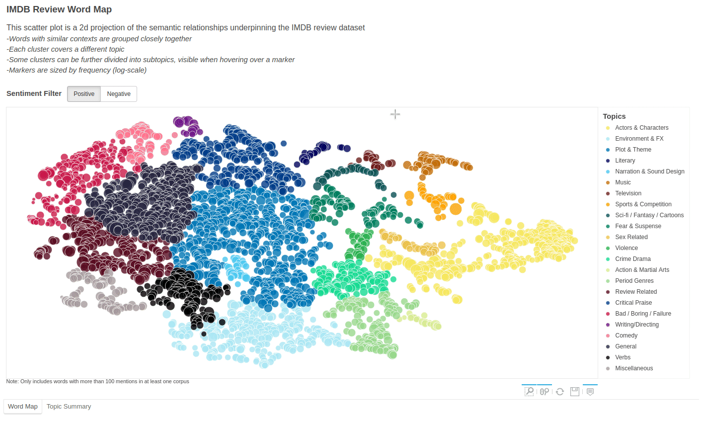

# TopicWordMap

This is an interactive word map to visualize language topics. This approach to word visualization can be applied to any type of text corpus, but in this case, the visualization is based on the [IMDB movie review](http://ai.stanford.edu/~amaas/data/sentiment/) dataset1. Because of this, the visuals leverage the IMDB dataset's positive and negative review classes to compare topic incidence between sentiment polarities. 

<h1 align="left">
  
</h1>

This creation process for this visualisation is as follows(python scripts stored in the *scripts* directory):

**1. Run preprocess_text.py**

Process and normalize raw text reviews. This step includes removing expanding contractions, removing punctuation, html tags, and stop words, singularizing and lemmatizing. Positive and negative documents are processed and saved in separate CSV files. Note the script makes use of multiprocessing to speed up this process. Even though IMDB's dataset is only 50,000 documents(including train & test splits), some reviews can be quite lengthy, making this script take a while to run with a single CPU. 

**2. Run build_embedding.py**

Learn a word embedding from the processed corpuses. I use Gensim's implementation of FastText in the script. Although FastText will not produce contextually varying representations like some more modern approaches (ie, Transformers), since the ultimate goal is a data visualization in 2d, embedding with the average context is sufficient. Prior to training the FastText model, I combine both positive and negative corpuses into a single, global corpus. The model, and resulting word vectors, are stored in the *modelling* directory.

**3. Run compute_stats.py**

Once I have the word vectors from the previous step, I compute some key statistics on the retained vocabulary. Namely, word mentions in each corpus(as well as their log-transform). The script also computes average TF-IDF, although this is not used in the final plot.

**4. Run project_and_cluster.py**

With UMAP, project the word vectors into a 2-dimensional space. A key parameter to this projection is the size of the local neighbourhood for each data point. This script uses a neighbourhood value of 6, which is a quite low, and produces a projection that is highly focused on the local structure of the data space. Then I search this 2d space for clusters using agglomerative clustering. The output of this script forms the basis of the final visualization.

**5. Review and label cluster topics**

At this stage, the clusters need to be manually reviewed and labelled. While this is a time-consuming step, the clustering algorithm only finds the clusters, it doesn't name them. Only manual review can produce the topic and subtopic labels. Furthermore, manual review is needed to uncover the cluster relationships, ie. some clusters are closely related to others in content, and are best charactized as subtopics in a more general topic cluster. Other clusters can be merged. This step is, in part, subjective. Other people may interpret and arrange some clusters differently. To view my work at this stage, refer to the files *cluster_map_n6_t100.csv* and *umap_projection_n6_t100_reviewed.csv* in the *modelling* directory.

**6. Run dataviz.py**

The final step in the process, the word map and topic summary are built with Bokeh. The script has some requirements, mostly outputs from previous stages. These can be found in the *modelling* directory:

 - *umap_projection_n6_t100_reviewed.csv* - the product of the cluster review from previous step 5. This file contains the words, their (x, y) coordinates, and cluster ids.
 - *cluster_map_n6_t100.csv* - a mapping of cluster id to topic & subtopic labels.
 - *positive_text_vocab_stats.csv / negative_text_vocab_stats.csv* - these are the mention counts from step 3.
 - *legend_layout.csv* - this file provides the topic order of the map legend, as well as the colours for each topic. 

The word map displays all the topic clusters generated in previous steps. It provides a filter to toggle between positive and negative sentiment. The topic summary aggregates all the topic clusters and offers a comparison between positive and negative topic distributions. 

 1: Andrew L. Maas, Raymond E. Daly, Peter T. Pham, Dan Huang, Andrew Y. Ng, and Christopher Potts. (2011). [Learning Word Vectors for Sentiment Analysis.](http://ai.stanford.edu/~amaas/papers/wvSent_acl2011.pdf)  *The 49th Annual Meeting of the Association for Computational Linguistics (ACL 2011).*
